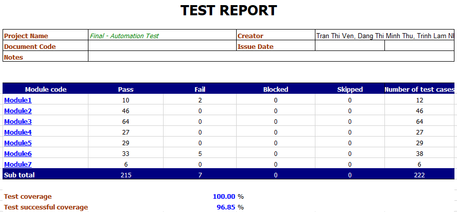
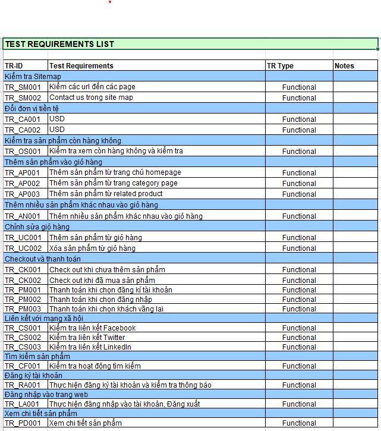
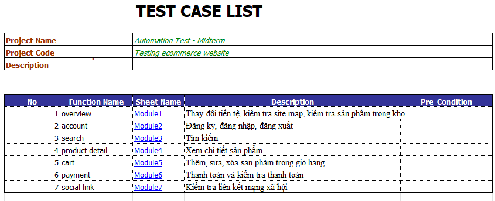

# Automation-Test-Store

---
Testing a project on a site like Automation Test Store can provide valuable insights and experiences that can enhance your skills as a QA Software Tester. Here are some key takeaways you might gain from such a project:

1. Understanding of E-commerce Workflows:
- User Registration and Login: Ensuring the registration and login processes are smooth and secure.
- Product Search and Filtering: Testing the functionality of search and filter features to ensure users can easily find products.
- Shopping Cart Functionality: Verifying that products can be added, removed, and updated in the shopping cart accurately.
- Checkout Process: Ensuring the checkout process is seamless, including payment gateway integration and order confirmation.

2. Technical Skills Development:
- Test Planning and Test Case Creation: Learning to create detailed test plans and test cases that cover all aspects of the e-commerce application.
Automated Testing Tools: Gaining hands-on experience with tools like Selenium, JUnit, or TestNG for automating test cases.
Bug Tracking: Using bug tracking tools such as JIRA to log and manage defects found during testing.
3. Documentation and Reporting:
Detailed Reporting: Writing clear and detailed bug reports, test summaries, and documentation.
Metrics and KPIs: Tracking testing metrics and key performance indicators to measure the effectiveness of the testing process.
Conclusion
Testing a project like Automation Test Store allows you to apply a wide range of QA skills in a real-world context. You can improve your technical expertise, understand complex e-commerce workflows, and enhance your ability to work effectively within an Agile team. This experience can significantly contribute to your professional growth and readiness for more advanced QA roles.
This project aims to perform an analysis of restaurant data from Zomato and build a predictive model to forecast certain aspects related to restaurant performance. Here's an outline of what the project involves:

## Tools used
### Tools: 
- Robot Framework: A generic test automation framework used for acceptance testing and acceptance test-driven development (ATDD).
- VS Code: A source-code editor made by Microsoft for Windows, Linux, and macOS. It includes support for debugging, embedded Git control, syntax highlighting, intelligent code completion, snippets, and code refactoring.
### Dashboard: 
- Excel: Used for creating and maintaining dashboards to track test results, metrics, and key performance indicators (KPIs).
### Libraries used 
> - SeleniumLibrary
> - BuiltIn
> - OperatingSystem
> - Collections
> - String
***
### Author
> TranTrucVy: 
<*https://github.com/TranTrucVy*>
